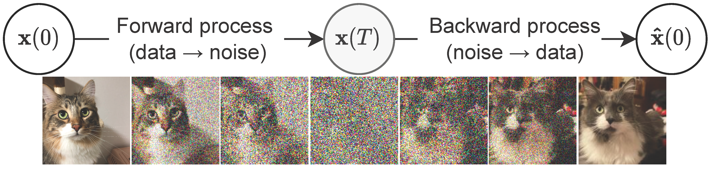
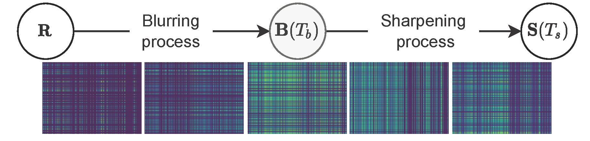

# Blurring-Sharpening Process Models for Collaborative Filtering
 
 [](https://arxiv.org/abs/2211.09324) [](https://hits.seeyoufarm.com)

[](https://paperswithcode.com/sota/recommendation-systems-on-amazon-book?p=perturbation-recovery-method-for)
[](https://paperswithcode.com/sota/recommendation-systems-on-gowalla?p=perturbation-recovery-method-for)
[](https://paperswithcode.com/sota/recommendation-systems-on-yelp2018?p=perturbation-recovery-method-for)

## Introduction
- Please see our paper for more details: [Blurring-Sharpening Process Models for Collaborative Filtering](https://arxiv.org/abs/2211.09324).
- We have more interesting works on recommender systems, please check our [LT-OCF](https://dl.acm.org/doi/abs/10.1145/3459637.3482449) ([code](https://github.com/jeongwhanchoi/LT-OCF)) and [HMLET](https://dl.acm.org/doi/abs/10.1145/3488560.3498501) ([code](https://github.com/jeongwhanchoi/HMLET)).
- We will update arguments information of the code soon.


Score-based generative models (SGMs) |  Our blurring-sharpening process models (BSPMs)
:-------------------------:|:-------------------------:
 | 

> The comparison between SGMs and our proposed BSPMs. SGMs, a recently proposed paradigm for deep generative tasks, outperform generative adversarial networks (GANs), variational autoencoders (VAEs), and many other generative models. 
> - SGMs use two stochastic processes, one for the forward perturbation and the other for the backward recovery. Since the recovery process is stochastic, it does not typically converge to the original sample $\mathbf{x}(0)$ but to another similar sample. After training, only the recovery process is used to generate fake samples from random noisy vectors $\mathbf{x}(T) \sim \mathcal{N}(\mathbf{\mu}, \mathbf{\sigma})$.
> - Our BSPMs use two deterministic blurring and sharpening processes. Unlike SGMs trained with many images, our BSPMs process only one interaction matrix; therefore, we use deterministic processes.

---

## Citation

Please cite our paper if using this code.

```
@inproceedings{choi2023bspm,
  title={Blurring-Sharpening Process Models for Collaborative Filtering},
  author={Choi, Jeongwhan and Hong, Seoyoung and Park, Noseong and Cho, Sung-Bae},
  booktitle={Proceedings of the ACM Conference on Research and Development in Information Retrieval (SIGIR)},
  year={2023}
}
```

---

## Requirement:

```bash
conda env create -f environment.yml
conda activate bspm
```

## Run experiment:
go to folder `bspm`

- Gowalla
```bash
# CPU
python main.py --dataset="gowalla" --topks="[20]" --simple_model="bspm" --solver_shr="rk4" --K_s=1 --T_s=2.5 --final_sharpening=True --idl_beta=0.2 --factor_dim=448

# GPU
python main.py --dataset="gowalla" --topks="[20]" --simple_model="bspm-torch" --testbatch=2048 --solver_shr="rk4" --K_s=1 --T_s=2.5 --final_sharpening=True --idl_beta=0.2 --factor_dim=448 
```

- Yelp2018

```bash
# CPU
python main.py --dataset="yelp2018" --topks="[20]" --simple_model="bspm" --solver_shr="euler" --K_s=1 --T_s=1.2 --final_sharpening=True --t_point_combination=True --factor_dim=384

# GPU
python main.py --dataset="yelp2018" --topks="[20]" --simple_model="bspm-torch" --testbatch=2048 --solver_shr="euler" --K_s=1 --T_s=1.2 --final_sharpening=True --t_point_combination=True  --factor_dim=384
```

- Amazon-book

```bash
# CPU
python main.py --dataset="amazon-book" --topks="[20]" --simple_model="bspm" --solver_shr="rk4" --K_s=2 --T_s=2.2 --final_sharpening=False
# GPU
python main.py --dataset="amazon-book" --topks="[20]" --simple_model="bspm-torch" --testbatch=2048 --solver_shr="rk4" --K_s=2 --T_s=2.2 --final_sharpening=False 
```

## Arguements
- `final_sharpening`
    - True: EM (Early Merge)
    - False: LM (Late Merge)
- `solver_shr`
    - `euler`: Euler method
    - `rk4`: Runge-Kutta 4th order method
- `K_s`:
    - The number of sharpening step
- `T_s`:
    - The terminal time of sharpening ODE
- `t_point_combination`:
    - True: Use the combination of t points
- `idl_beta`:
    - The beta value of IDL
- `factor_dim`:
    - The dimension of latent factors